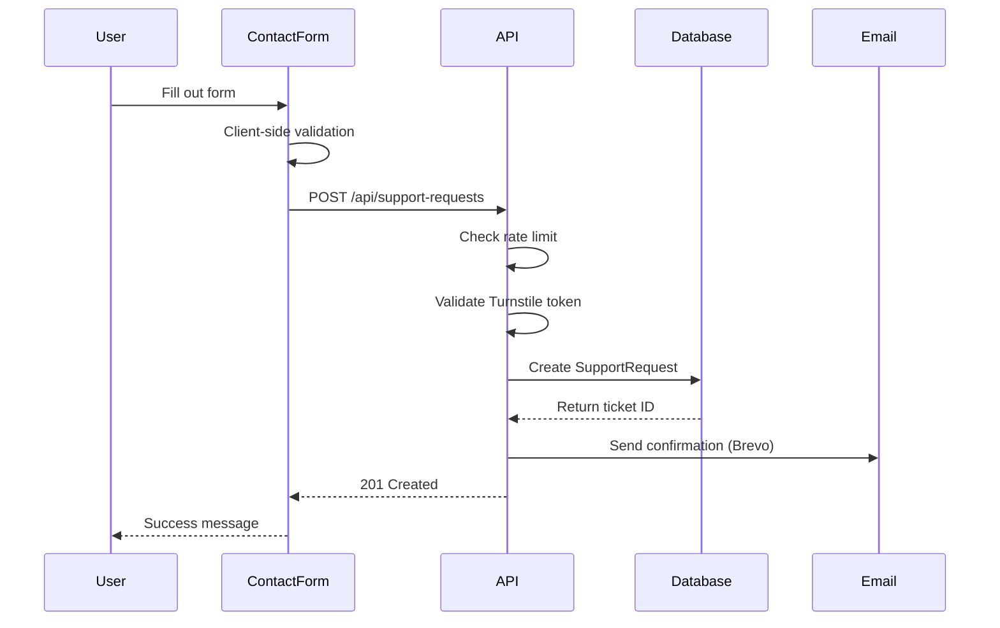
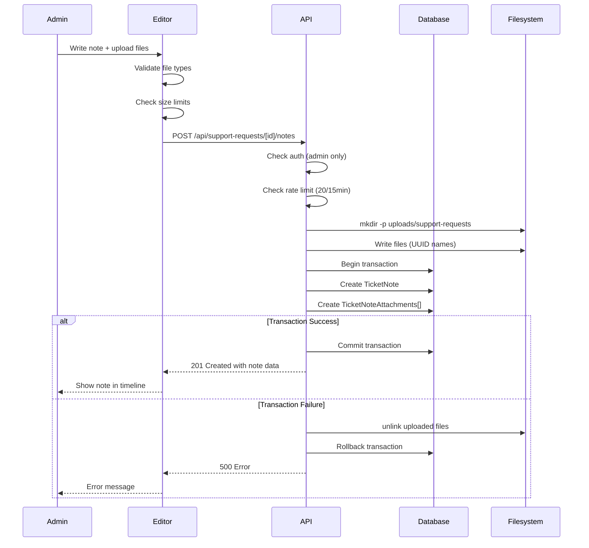
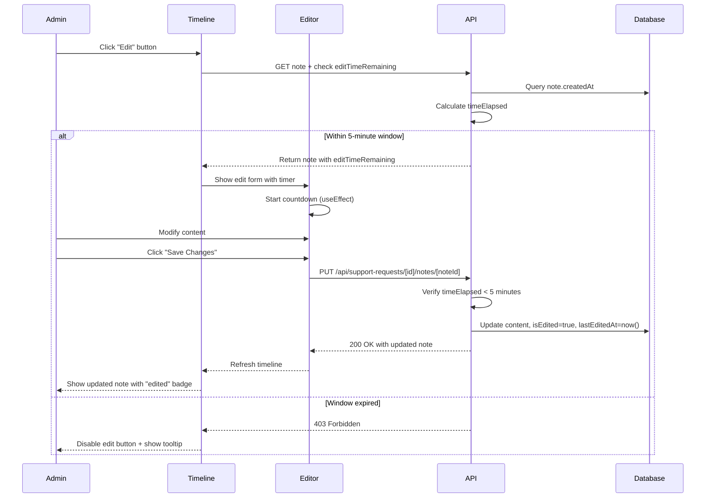
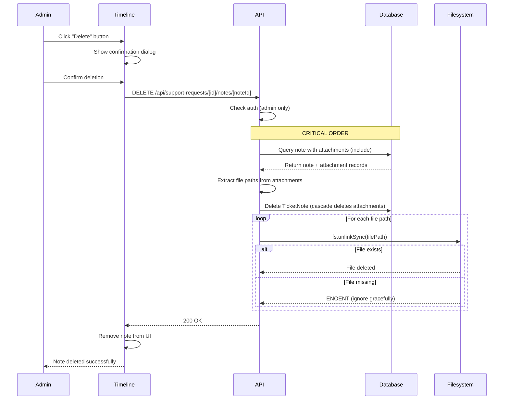

# Helpdesk System Documentation

## Overview

The helpdesk system provides a comprehensive solution for managing user support requests with rich internal note-taking capabilities, file attachments, and status tracking. It enables administrators to efficiently handle support tickets while maintaining detailed communication history and documentation.

**Key Features**:

- User-submitted support requests with categorization and priority levels
- Admin-only internal notes with markdown formatting
- File attachment support (images, documents, up to 25MB total)
- Status change tracking with full audit trail
- Time-bounded edit window (5 minutes) for note corrections
- Rate limiting to prevent spam and abuse
- XSS protection via markdown sanitization

---

## Architecture

### Data Models

The helpdesk system is built on four core database models:

#### 1. `SupportRequest`

User-submitted support tickets containing the initial inquiry.

```prisma
model SupportRequest {
  id          String   @id @default(cuid())
  name        String   // Requester's name
  email       String   // Requester's email
  category    String   // GENERAL, TECHNICAL, HOF_DATA, etc.
  priority    String   // LOW, NORMAL, HIGH
  status      String   // OPEN, IN_PROGRESS, RESOLVED, CLOSED, etc.
  subject     String   // Short summary
  message     String   // Full request description
  createdAt   DateTime @default(now())
  updatedAt   DateTime @updatedAt

  notes         TicketNote[]
  statusHistory TicketStatusHistory[]
  attachments   SupportRequestAttachment[]
}
```

#### 2. `TicketNote`

Admin-created notes with optional file attachments.

```prisma
model TicketNote {
  id                String   @id @default(cuid())
  content           String   // Markdown content (max 9,999 chars)
  isInternal        Boolean  @default(true) // Admin-only visibility
  isEdited          Boolean  @default(false)
  lastEditedAt      DateTime?
  supportRequestId  String
  authorId          String
  createdAt         DateTime @default(now())
  updatedAt         DateTime @updatedAt

  supportRequest SupportRequest @relation(fields: [supportRequestId], ...)
  author         User           @relation(fields: [authorId], ...)
  attachments    TicketNoteAttachment[]
}
```

**Edit Window Rules**:

- Notes can be edited for **5 minutes** after creation (`EDIT_WINDOW_MS = 5 * 60 * 1000`)
- After 5 minutes, notes become immutable to maintain audit trail integrity
- First edit sets `isEdited = true` and `lastEditedAt = now()`
- Subsequent edits update only `lastEditedAt`

#### 3. `TicketStatusHistory`

Audit trail of all status changes with timestamps.

```prisma
model TicketStatusHistory {
  id               String   @id @default(cuid())
  supportRequestId String
  oldStatus        String
  newStatus        String
  changedAt        DateTime @default(now())
  changedById      String

  supportRequest SupportRequest @relation(fields: [supportRequestId], ...)
  changedBy      User           @relation(fields: [changedById], ...)
}
```

#### 4. `TicketNoteAttachment`

File metadata for note attachments.

```prisma
model TicketNoteAttachment {
  id           String   @id @default(cuid())
  noteId       String
  filename     String   // UUID-based stored filename
  originalName String   // User's original filename
  mimeType     String
  size         Int      // Bytes
  path         String   // Public URL path
  createdAt    DateTime @default(now())

  note TicketNote @relation(fields: [noteId], onDelete: Cascade)
}
```

**Storage Structure**:

```
public/
└── uploads/
    └── support-requests/
        ├── {uuid}-image.jpg
        ├── {uuid}-document.pdf
        └── ...
```

---

## Components

### 1. `HelpdeskManagement`

**Location**: `app/components/features/helpdesk/HelpdeskManagement.tsx`

Admin dashboard for viewing and managing all support requests.

**Features**:

- Paginated list of all support tickets
- Filtering by status, category, priority
- Search by name, email, subject
- Quick status updates
- Ticket assignment (if implemented)

**Props**:

```typescript
interface HelpdeskManagementProps {
  initialTickets?: SupportRequest[];
  initialPage?: number;
  initialLimit?: number;
}
```

---

### 2. `TicketDetail`

**Location**: `app/components/features/helpdesk/TicketDetail.tsx`

Single ticket view displaying full request details and timeline.

**Features**:

- Requester information display (name, email, submission date)
- Original message/subject display
- Status and priority controls
- Notes timeline integration
- File attachments (if on request itself)

**Props**:

```typescript
interface TicketDetailProps {
  ticket: SupportRequest & {
    notes: TicketNote[];
    statusHistory: TicketStatusHistory[];
  };
  onUpdate: () => void;
}
```

**Responsive Behavior**:

- Mobile (< 640px): Requester info stacked vertically (1 column)
- Tablet (640px - 1024px): 2 columns
- Desktop (> 1024px): 3 columns

---

### 3. `TicketNoteEditor`

**Location**: `app/components/features/helpdesk/TicketNoteEditor.tsx`  
**Lines of Code**: 528

Rich markdown editor for creating and editing notes with file uploads.

**Features**:

- Markdown toolbar (bold, italic, list, link)
- Live preview toggle
- Character counter (9,999 limit)
- File upload with drag-and-drop
- Image paste from clipboard
- Multiple file preview grid
- Edit timer countdown (5 minutes)
- Unsaved changes warning (beforeunload event)

**Props**:

```typescript
interface TicketNoteEditorProps {
  ticketId: string;
  onSubmit: (note: TicketNote) => void;

  // Edit mode props
  noteId?: string;
  initialContent?: string;
  initialIsInternal?: boolean;
  editTimeRemaining?: number; // Seconds
  onCancel?: () => void;
}
```

**File Validation**:

```typescript
// Per-file limit
MAX_FILE_SIZE = 5 * 1024 * 1024; // 5MB

// Total upload limit
MAX_TOTAL_SIZE = 25 * 1024 * 1024; // 25MB

// Allowed types
ALLOWED_MIME_TYPES = [
  "image/jpeg",
  "image/png",
  "image/gif",
  "image/webp",
  "application/pdf",
  "application/msword",
  "application/vnd.openxmlformats-officedocument.wordprocessingml.document",
  "application/vnd.ms-excel",
  "application/vnd.openxmlformats-officedocument.spreadsheetml.sheet",
  "text/plain",
  "text/csv",
];

// Allowed extensions
ALLOWED_EXTENSIONS = [
  ".jpg",
  ".jpeg",
  ".png",
  ".gif",
  ".webp",
  ".pdf",
  ".doc",
  ".docx",
  ".xls",
  ".xlsx",
  ".txt",
  ".csv",
];
```

**Accessibility Features**:

- `aria-labels` on all icon buttons
- `aria-describedby` linking character counter to textarea
- `aria-live="polite"` for loading state announcements
- `aria-live="polite"` for edit timer countdown
- `role="alert"` and `aria-live="assertive"` for error messages
- Keyboard-accessible file upload (Enter/Space triggers file picker)
- Focus management after markdown insertions

---

### 4. `TicketTimeline`

**Location**: `app/components/features/helpdesk/TicketTimeline.tsx`  
**Lines of Code**: 470

Chronological display of notes and status changes merged together.

**Features**:

- Merges notes and status changes in chronological order
- Image preview with lightbox modal
- File download links for documents
- Edit/delete controls (with permission checks)
- "Last edited" indicators
- Internal note badges
- Author information display

**Props**:

```typescript
interface TicketTimelineProps {
  ticketId: string;
  notes: TimelineNote[];
  statusHistory: TimelineStatusChange[];
  currentUserId: string;
  onNoteUpdate: () => void;
}
```

**Timeline Item Types**:

```typescript
type TimelineItem =
  | { type: "note"; data: TimelineNote }
  | { type: "status"; data: TimelineStatusChange };
```

**Responsive Behavior**:

- Mobile (< 640px): 2-column attachment grid
- Tablet (640px - 1024px): 3-column attachment grid
- Desktop (> 1024px): 4-column attachment grid

**Accessibility**: Focus trap in image preview modal using `useEffect` and `useRef`.

---

### 5. `ContactForm`

**Location**: `app/components/features/helpdesk/ContactForm.tsx`

Public-facing form for users to submit support requests.

**Features**:

- Name, email, subject, message fields
- Category selection (General, Technical, HOF Data)
- Priority selection (optional, defaults to Normal)
- File attachment support (optional)
- Turnstile CAPTCHA (production only)
- Client-side validation
- Rate limiting (15-minute window)

**Props**:

```typescript
interface ContactFormProps {
  onSuccess?: () => void;
  defaultCategory?: string;
}
```

---

## API Endpoints

### Base Path: `/api/support-requests`

#### 1. **List Support Requests**

```
GET /api/support-requests?page=1&limit=20&status=OPEN
```

**Query Parameters**:

- `page` (number): Page number (1-indexed)
- `limit` (number): Items per page (default: 20, max: 100)
- `status` (string): Filter by status
- `category` (string): Filter by category
- `priority` (string): Filter by priority
- `search` (string): Search name, email, subject

**Response**:

```json
{
  "data": [
    {
      "id": "req-abc123",
      "name": "John Doe",
      "email": "john@example.com",
      "category": "TECHNICAL",
      "priority": "HIGH",
      "status": "OPEN",
      "subject": "Cannot upload peak data",
      "message": "I'm getting an error when...",
      "createdAt": "2026-01-30T10:00:00Z",
      "updatedAt": "2026-01-30T10:00:00Z"
    }
  ],
  "total": 145,
  "pages": 8
}
```

**Auth Required**: Admin only

---

#### 2. **Get Single Support Request**

```
GET /api/support-requests/[id]
```

**Response**: Includes full ticket details with notes and status history.

```json
{
  "data": {
    "id": "req-abc123",
    "name": "John Doe",
    "email": "john@example.com",
    "category": "TECHNICAL",
    "priority": "HIGH",
    "status": "OPEN",
    "subject": "Cannot upload peak data",
    "message": "Full message content...",
    "createdAt": "2026-01-30T10:00:00Z",
    "updatedAt": "2026-01-30T10:05:00Z",
    "notes": [...],
    "statusHistory": [...]
  }
}
```

**Auth Required**: Admin only

---

#### 3. **Create Support Request**

```
POST /api/support-requests
Content-Type: application/json

{
  "name": "John Doe",
  "email": "john@example.com",
  "category": "GENERAL",
  "priority": "NORMAL",
  "subject": "Question about HOF qualification",
  "message": "I climbed 50 peaks last year..."
}
```

**Response**: `201 Created` with ticket data

**Auth Required**: None (public endpoint)  
**Rate Limit**: 5 requests per 15 minutes (by IP + email hash)  
**Bot Protection**: Turnstile CAPTCHA (production only)

---

#### 4. **Update Support Request**

```
PUT /api/support-requests/[id]
Content-Type: application/json

{
  "status": "IN_PROGRESS",
  "priority": "HIGH"
}
```

**Response**: `200 OK` with updated ticket

**Auth Required**: Admin only

---

#### 5. **Create Note**

```
POST /api/support-requests/[id]/notes
Content-Type: multipart/form-data

content: "Internal note about user's issue"
isInternal: true
compressImages: true
files: [File, File, ...]
```

**Response**: `201 Created` with note data including attachments

**Auth Required**: Admin only  
**Rate Limit**: 20 notes per 15 minutes (by user ID)

**Security Checks**:

- File type validation (MIME + extension)
- File size validation (5MB per file, 25MB total)
- Directory creation (mkdir recursive)
- File cleanup on transaction failure (unlink in catch block)

---

#### 6. **Edit Note**

```
PUT /api/support-requests/[id]/notes/[noteId]
Content-Type: application/json

{
  "content": "Updated note content"
}
```

**Response**: `200 OK` with updated note

**Auth Required**: Admin only  
**Edit Window**: Must be within 5 minutes of creation  
**Response Codes**:

- `200`: Success
- `403`: Edit window expired
- `404`: Note not found

---

#### 7. **Delete Note**

```
DELETE /api/support-requests/[id]/notes/[noteId]
```

**Response**: `200 OK` with deletion confirmation

**Auth Required**: Admin only

**Deletion Process**:

1. Query note with attachments (include relations)
2. **Collect file paths BEFORE database deletion** (critical for cleanup)
3. Delete from database (cascade deletes attachments)
4. Delete files from filesystem (handle missing files gracefully)

**Why File Paths First?**  
If database deletion happens first, attachment records are gone and file paths are lost, resulting in orphaned files.

---

#### 8. **Get Status History**

```
GET /api/support-requests/[id]/status-history
```

**Response**: Chronological list of status changes

```json
{
  "data": [
    {
      "id": "hist-123",
      "supportRequestId": "req-abc123",
      "oldStatus": "OPEN",
      "newStatus": "IN_PROGRESS",
      "changedAt": "2026-01-30T11:00:00Z",
      "changedBy": {
        "id": "user-456",
        "displayName": "Admin User",
        "username": "adminuser"
      }
    }
  ]
}
```

**Auth Required**: Admin only

---

## Security Policies

### 1. Edit Window (5 Minutes)

**Rationale**: Notes can be edited for 5 minutes after creation to allow for typo corrections and immediate updates, but become immutable afterward to prevent historical tampering and maintain audit trail integrity.

**Implementation**:

```typescript
// src/lib/helpdesk-constants.ts
export const EDIT_WINDOW_MS = 5 * 60 * 1000; // 5 minutes in milliseconds

// API route check
const timeElapsed = Date.now() - new Date(note.createdAt).getTime();
if (timeElapsed > EDIT_WINDOW_MS) {
  return NextResponse.json(
    {
      error: "Edit window expired. Notes can only be edited within 5 minutes of creation.",
    },
    { status: 403 }
  );
}
```

**Client-side Timer**:

```typescript
// TicketNoteEditor.tsx - Countdown timer
useEffect(() => {
  if (isEditMode && timeLeft > 0) {
    const timer = setInterval(() => {
      setTimeLeft((prev) => Math.max(0, prev - 1));
    }, 1000);
    return () => clearInterval(timer);
  }
}, [isEditMode, timeLeft]);

// Disable textarea when timer expires
disabled={loading || (isEditMode && timeLeft === 0)}
```

**Why 5 Minutes?**

- Long enough for quick typo fixes
- Short enough to prevent major rewrites
- Balances usability with audit integrity

---

### 2. Rate Limiting (20 Notes / 15 Minutes)

**Rationale**: Prevents spam attacks, accidental duplicate submissions, and database flooding from malicious actors or misbehaving clients.

**Implementation**:

```typescript
// src/lib/helpdesk-constants.ts
export const NOTE_RATE_LIMIT = {
  window: 15 * 60, // 15 minutes in seconds
  max: 20, // Maximum 20 notes per window
};

// API route check
import { checkRateLimit } from "@/src/lib/rateLimit";

const rateLimitResult = await checkRateLimit(userId, "note-creation");
if (!rateLimitResult.allowed) {
  return NextResponse.json(
    { error: "Rate limit exceeded. Please wait before creating more notes." },
    { status: 429 }
  );
}
```

**Storage**: Rate limit attempts stored in `rate_limit_attempts` table with hashed identifiers (SHA-256 of user ID) for privacy.

**Cleanup**: Automatic cleanup via `npm run db:cleanup-rate-limits` removes attempts older than 24 hours.

---

### 3. File Type Whitelist

**Rationale**: Whitelist approach (allow only known-safe types) prevents executable uploads that could lead to Remote Code Execution (RCE) attacks. Defense-in-depth: checks both MIME type AND file extension.

**Blocked Types**:

- Executables: `.exe`, `.bat`, `.sh`, `.cmd`, `.com`
- Scripts: `.js`, `.py`, `.rb`, `.pl`, `.php`
- Archives: `.zip`, `.rar`, `.7z`, `.tar`, `.gz` (to prevent nested malware)
- System files: `.dll`, `.so`, `.dylib`

**Allowed Types**:

- Images: `.jpg`, `.jpeg`, `.png`, `.gif`, `.webp`
- Documents: `.pdf`, `.doc`, `.docx`, `.xls`, `.xlsx`
- Text: `.txt`, `.csv`

**Validation Function**:

```typescript
export function validateFileType(file: File): {
  valid: boolean;
  error?: string;
} {
  const extension = file.name.split(".").pop()?.toLowerCase();

  if (!extension || !ALLOWED_EXTENSIONS.includes(`.${extension}`)) {
    return { valid: false, error: `File type .${extension} not allowed` };
  }

  if (!ALLOWED_MIME_TYPES.includes(file.type)) {
    return { valid: false, error: `MIME type ${file.type} not allowed` };
  }

  return { valid: true };
}
```

**Client-side** (in TicketNoteEditor) **AND** server-side (in API route) validation for defense-in-depth.

---

### 4. XSS Protection

**Rationale**: User-generated content (markdown notes) could contain malicious scripts. Sanitization prevents Cross-Site Scripting (XSS) attacks.

**Implementation**:

```typescript
// TicketTimeline.tsx
import ReactMarkdown from 'react-markdown';
import rehypeSanitize from 'rehype-sanitize';

<ReactMarkdown
  remarkPlugins={[remarkGfm]}
  rehypePlugins={[rehypeSanitize]} // ← XSS protection
>
  {note.content}
</ReactMarkdown>
```

**What Gets Sanitized**:

- `<script>` tags removed
- `onclick`, `onerror`, etc. event handlers stripped
- `javascript:` URLs blocked
- `<iframe>`, `<object>`, `<embed>` tags removed

---

### 5. Authentication & Authorization

**All Helpdesk APIs require admin authentication except**:

- `POST /api/support-requests` (public contact form)

**Implementation**:

```typescript
import { getServerSession } from "next-auth";
import { authOptions } from "@/src/lib/auth";

const session = await getServerSession(authOptions);
if (!session) {
  return NextResponse.json({ error: "Unauthorized" }, { status: 401 });
}

if (session.user.role !== "ADMIN") {
  return NextResponse.json({ error: "Forbidden. Admin access required." }, { status: 403 });
}
```

**Middleware Protection**: `middleware.ts` enforces `/admin/helpdesk/**` routes require admin role.

---

## Workflows

### Workflow 1: User Submits Support Request



---

### Workflow 2: Admin Creates Note with Attachments



---

### Workflow 3: Admin Edits Note (Within Window)



---

### Workflow 4: File Cleanup on Note Deletion



**Critical Design Decision**: File paths must be collected **BEFORE** database deletion. If database deletion happens first, attachment records are lost and file paths become unavailable, resulting in orphaned files.

---

## Configuration

### Constants File

**Location**: `src/lib/helpdesk-constants.ts`

All configurable values centralized for easy maintenance:

```typescript
// File upload limits
export const MAX_FILE_SIZE = 5 * 1024 * 1024; // 5MB per file
export const MAX_TOTAL_SIZE = 25 * 1024 * 1024; // 25MB total
export const MAX_CONTENT_LENGTH = 9999; // Characters

// Edit window
export const EDIT_WINDOW_MS = 5 * 60 * 1000; // 5 minutes

// Rate limiting
export const NOTE_RATE_LIMIT = {
  window: 15 * 60, // 15 minutes
  max: 20, // 20 notes per window
};

// Allowed file types
export const ALLOWED_MIME_TYPES = [
  "image/jpeg",
  "image/png",
  "image/gif",
  "image/webp",
  "application/pdf",
  "application/msword",
  "application/vnd.openxmlformats-officedocument.wordprocessingml.document",
  "application/vnd.ms-excel",
  "application/vnd.openxmlformats-officedocument.spreadsheetml.sheet",
  "text/plain",
  "text/csv",
];

export const ALLOWED_EXTENSIONS = [
  ".jpg",
  ".jpeg",
  ".png",
  ".gif",
  ".webp",
  ".pdf",
  ".doc",
  ".docx",
  ".xls",
  ".xlsx",
  ".txt",
  ".csv",
];
```

**Why Centralize?**

- Single source of truth for all validation rules
- Easy to adjust limits without hunting through code
- Consistent values between client and server
- Clear documentation of system constraints

---

## Testing

### Test Coverage

- **API Routes**: `__tests__/api/support-requests/` (3 files)
  - `notes.api.test.ts` - Create notes with file uploads
  - `notes-edit.api.test.ts` - Edit window enforcement
  - `notes-delete.api.test.ts` - Deletion with file cleanup

- **E2E Tests**: `__tests__/e2e/helpdesk-notes.e2e.test.ts`
  - Create note with attachments
  - Edit within/after time window
  - Delete note with file cleanup
  - Status timeline integration
  - File upload validation
  - Markdown toolbar functionality

- **Accessibility**: `__tests__/a11y/` (if created)
  - Keyboard navigation
  - Screen reader support
  - ARIA attributes

### Running Tests

```bash
# Run all API tests
npm run test:api

# Run specific test file
npx jest __tests__/api/support-requests/notes.api.test.ts

# Run E2E tests
npm run test:e2e

# Run with coverage
npm run test:coverage
```

---

## Deployment Checklist

Before deploying helpdesk feature to production:

- [x] Database schema migrated (`npx prisma migrate deploy`)
- [x] All constants configured in `helpdesk-constants.ts`
- [x] Upload directory created (`public/uploads/support-requests/`)
- [x] Permissions set (write access for Node.js process)
- [ ] Rate limiting tested (simulate 21 notes in 15 minutes)
- [ ] File upload limits tested (6MB file, 30MB total)
- [ ] Edit window tested (create note, wait 6 minutes, try edit)
- [ ] XSS protection verified (insert `<script>alert('xss')</script>` in note)
- [ ] File cleanup tested (create note with files, delete DB record, verify files deleted)
- [ ] Brevo email integration configured (confirmation emails)
- [ ] Turnstile CAPTCHA configured (production keys in env)
- [ ] Admin role permissions verified (non-admin cannot access)

---

## Troubleshooting

### Issue: Files Not Uploading

**Symptoms**: File upload fails with ENOENT error

**Cause**: Upload directory doesn't exist

**Solution**:

```typescript
// API route - Create directory before upload
import fs from "fs";
import path from "path";

const uploadDir = path.join(process.cwd(), "public", "uploads", "support-requests");
if (!fs.existsSync(uploadDir)) {
  fs.mkdirSync(uploadDir, { recursive: true });
}
```

---

### Issue: Orphaned Files After Note Deletion

**Symptoms**: Files remain in `uploads/` after note deleted

**Cause**: File paths collected AFTER database deletion (when attachment records are already gone)

**Solution**: Always query attachments BEFORE deleting from database:

```typescript
// CORRECT ORDER
const note = await prisma.ticketNote.findUnique({
  where: { id: noteId },
  include: { attachments: true }, // ← Get file paths first
});

const filePaths = note.attachments.map((a) => a.path);

await prisma.ticketNote.delete({ where: { id: noteId } }); // ← Then delete DB

filePaths.forEach((filePath) => fs.unlinkSync(filePath)); // ← Then delete files
```

---

### Issue: Edit Window Not Working

**Symptoms**: Can edit notes older than 5 minutes

**Cause**: Server and client clocks out of sync, or edit window check missing

**Solution**:

```typescript
// Ensure server-side check exists
const timeElapsed = Date.now() - new Date(note.createdAt).getTime();
if (timeElapsed > EDIT_WINDOW_MS) {
  return NextResponse.json({ error: "Edit window expired" }, { status: 403 });
}
```

---

### Issue: Rate Limit Not Enforcing

**Symptoms**: Can create more than 20 notes in 15 minutes

**Cause**: Rate limit check missing or database cleanup removing recent attempts

**Solution**:

```typescript
// Verify rate limit check exists
import { checkRateLimit } from "@/src/lib/rateLimit";

const rateLimitResult = await checkRateLimit(userId, "note-creation");
if (!rateLimitResult.allowed) {
  return NextResponse.json({ error: "Rate limit exceeded" }, { status: 429 });
}
```

---

## Future Enhancements

Potential improvements for future iterations:

1. **Draft Auto-Save** (Medium Priority)
   - Save note drafts to localStorage every 10 seconds
   - Restore on page reload
   - Clear draft after successful submission

2. **Email Notifications** (High Priority)
   - Notify user when ticket status changes
   - Notify admins of new support requests
   - Configurable notification preferences

3. **Assignment System** (Medium Priority)
   - Assign tickets to specific admin users
   - Track workload distribution
   - Reassignment history

4. **Canned Responses** (Low Priority)
   - Predefined response templates
   - Insert common answers quickly
   - Customizable per admin

5. **Advanced Search** (Medium Priority)
   - Full-text search across notes
   - Date range filtering
   - Tag/label system

6. **Analytics Dashboard** (Low Priority)
   - Tickets resolved per day/week/month
   - Average response time
   - Most common categories

---

## Related Documentation

- [API Reference](API_REFERENCE.md) — the support-request endpoints
- [Security policy](../SECURITY.md) — authorization model, upload handling, accepted risks
- [`CHANGE_REQUEST_ATTACHMENTS.md`](CHANGE_REQUEST_ATTACHMENTS.md) — change-request attachment storage
- [Integrations guide](INTEGRATIONS.md) — Brevo email delivery for support notifications
- [Test status](../CONTRIBUTING.md#7-testing) — the failing suites at handover
- Test coverage audit — historical, internal (not published)

> The former links to `AUTH_SYSTEM.md`, `FILE_UPLOAD_SECURITY.md`,
> `ACCESSIBILITY.md` and `USER_JOURNEY_E2E_VALIDATION_HELPDESK_NOTES.md` were
> removed: those files do not exist in this repository.

---

**Last Updated**: January 30, 2026  
**Version**: 1.0.0
